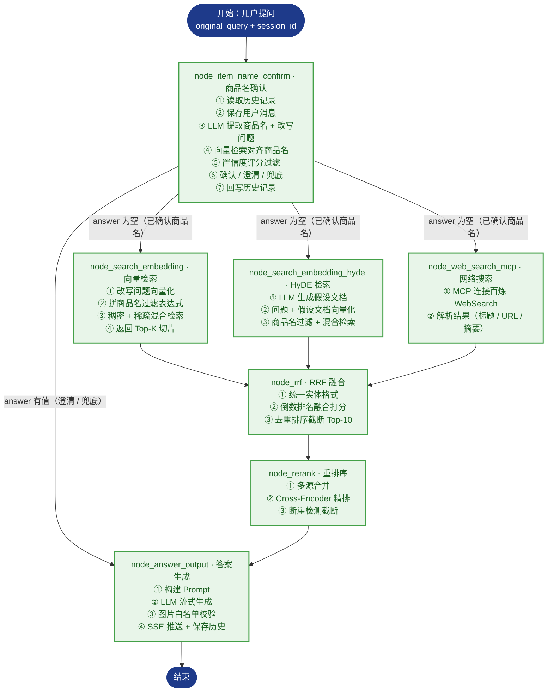

# RAG_Thinktank · rag智库

> 面向企业产品文档的 RAG（Retrieval-Augmented Generation）智能知识库系统，由 LangGraph 编排**导入（Import）**与**检索（Query）**两条流水线。导入管线把 PDF / Markdown 文档加工为可检索切片（chunks），生成稠密 + 稀疏混合向量并写入 Milvus；检索管线采用多路召回（向量 / HyDE / 网络搜索并行）→ RRF 融合 → 重排序 → 答案生成的策略，实现"先检索、再生成"的精准问答。

[](https://github.com/python/cpython)
[](https://github.com/langchain-ai/langgraph)
[](https://github.com/milvus-io/milvus)
[](https://huggingface.co/collections/BAAI/bge)
[](https://fastapi.tiangolo.com/)
[](https://github.com/minio/minio)

## 目录

- [项目简介](#项目简介)
- [核心特性](#核心特性)
- [技术栈](#技术栈)
- [目录结构](#目录结构)
- [导入管线（Import Pipeline）](#导入管线import-pipeline)
- [检索管线（Query Pipeline）](#检索管线query-pipeline)
- [快速开始](#快速开始quick-start)
- [环境变量配置](#环境变量配置)
- [测试](#测试)
- [当前状态与后续方向](#当前状态与后续方向)
- [附录：导入节点分步说明](#附录导入节点分步说明)
- [附录：检索节点分步说明](#附录检索节点分步说明)

## 项目简介

​		RAG_Thinktank（rag智库）是一个面向企业产品文档的 RAG 智能知识库系统，提供文档自动化导入与智能问答两大核心能力。RAG（检索增强生成）的核心是"先检索、再生成"三步：**Retrieval（检索）** 将用户问题转换为向量，在向量库中检索相似文档 → **Augmented（增强）** 把检索到的文档作为上下文，与问题一起构建 Prompt → **Generation（生成）** 由 LLM 基于增强后的 Prompt 生成答案。相比仅依赖训练知识回答问题的大模型，RAG 让回答建立在真实文档内容之上，从根本上缓解了事实幻觉、答案不准确、引用不可靠等问题。

​		本项目代码位于 `knowledge_base/`。**当前完成度：导入模块七节点、检索模块七节点全部实现，端到端链路已跑通**（PDF/MD → 切片 → Milvus → 多路召回 → RRF → 重排 → 答案生成 → SSE 流式问答），导入服务（8000）与检索服务（9091）可同时运行，配套的文件导入页与问答页均已可用。项目当前处于**功能闭环完成、进入优化打磨阶段**；已知问题与后续方向见 [当前状态与后续方向](#当前状态与后续方向)，一次联调问题的完整复盘见 。

## 核心特性

### 导入模块（Import Pipeline）

- **LangGraph 有状态编排**：`StateGraph` + 条件路由，PDF / Markdown 双入口自动分流
- **PDF 结构化解析**：接入 MinerU 在线 API（上传 → 轮询 → 下载解压 → 统一命名），保留表格 / 公式 / 图片
- **图片语义化**：Qwen3-VL-Flash 视觉模型对图片生成描述摘要，图片上传 MinIO，Markdown 引用替换为 ``
- **标题感知切分**：先按 Markdown 标题（1–6 级）初切，再用 `RecursiveCharacterTextSplitter`（当前 `CHUNK_SIZE=200` / 重叠 20）二次切分，注入 `title` / `parent_title` / `file_title` / `part` 元数据，chunks 落盘备份
  - 注意：`CHUNK_SIZE=200` 是**调试期测试值**（源码注释原文"小值方便测试切割"），正式使用建议调至 400~800 并重新导入，详见 [当前状态与后续方向](#当前状态与后续方向)
- **商品主体识别**：LLM 从文档前几个 chunk 拼接上下文识别商品名称（`item_name`），回填每个 chunk
- **稠密 + 稀疏混合向量**：BGE-M3 生成 1024 维稠密向量（语义）与稀疏向量（词袋，精确关键词匹配）
- **幂等入库**：按 `item_name` 先删后插、批量写入，Milvus 集合自动创建

### 检索模块（Query Pipeline）

- **商品名智能确认**：LLM 提取商品名 + 问题改写（含代词指代消解）→ 向量对齐（Milvus 检索标准名称）→ 置信度分级（≥0.85 直接确认 / 0.6~0.85 候选澄清 / <0.6 提示重输）
- **多路召回并行**：向量检索（混合检索）+ HyDE 假设文档检索 + MCP 网络搜索三路并发执行，提升召回率
- **RRF 融合排序**：倒数排名融合（Reciprocal Rank Fusion）合并向量与 HyDE 两路结果，去重排序截断 Top-10
- **历史对话管理**：MongoDB 按 `session_id` 关联多轮对话，商品名延迟回填补全历史记录
- **SSE 流式推送**：FastAPI 后台任务 + `asyncio.Queue`，实时推送检索进度与答案生成过程

## 技术栈

| 类别         | 选型                                                              | 状态     |
| ------------ | ----------------------------------------------------------------- | -------- |
| 语言 / 环境  | Python ≥ 3.11，uv 包管理（`uv.lock` 已提交）                      | 已交付   |
| 工作流       | LangGraph + LangChain（状态管理 + 条件路由 + 并发编排）           | 已交付   |
| 文档解析     | MinerU（PDF → Markdown，保留表格 / 公式 / 图片）                  | 已交付   |
| 视觉模型     | 通义千问 Qwen3-VL-Flash（图片描述生成）                           | 已交付   |
| 向量模型     | BGE-M3（1024 维稠密 + 稀疏混合向量）                              | 已交付   |
| 向量数据库   | Milvus（混合检索，WeightedRanker 加权融合）                       | 已交付   |
| 对象存储     | MinIO（原始文档 + 图片）                                          | 已交付   |
| LLM 接入     | 通义千问 Qwen-Flash（阿里云百炼 DashScope，OpenAI 兼容模式）      | 已交付   |
| 日志         | loguru                                                            | 已交付   |
| 后端框架     | FastAPI + Uvicorn（异步、原生 SSE 流式响应）                      | 已交付   |
| 文档数据库   | MongoDB（历史对话记录管理 + 商品名延迟回填）                      | 已交付   |
| 网络搜索     | 百炼 WebSearch（DashScope，经 MCP 协议调用）                      | 已交付   |
| 重排序模型   | BGE-Reranker-large（Cross-Encoder 精排 + 断崖检测截断）           | 已交付   |
| 前端         | 原生 HTML + JavaScript + EventSource（SSE 流式接收 + 图片渲染）   | 已交付   |
| 测试         | 节点自测（`__main__`）+ 环境验证脚本 01~06；暂缺自动化测试与 CI    | 部分     |

## 目录结构

```text
RAG_Thinktank/
├── README.md
├── .gitignore
├── docs/                          # 项目文档（含联调问题复盘）
└── knowledge_base/                # 项目主体（在此目录执行 uv 命令）
    ├── pyproject.toml             # 依赖与项目元信息
    ├── uv.lock                    # 锁定版本（提交，可复现环境）
    ├── .env.example               # 环境变量模板（提交）
    ├── app/
    │   ├── import_process/        # ★ 导入模块
    │   │   ├── agent/
    │   │   │   ├── state.py       # LangGraph 状态定义
    │   │   │   ├── main_graph.py  # 图编排（条件路由 + 7 节点）
    │   │   │   └── nodes/         # 7 个导入节点
    │   │   └── api/               # 文件导入服务
    │   ├── query_process/         # ★ 检索模块
    │   │   ├── agent/
    │   │   │   ├── state.py       # 查询状态定义（QueryGraphState）
    │   │   │   ├── main_graph.py  # 图编排（条件路由 + 三路并行 + 7 节点）
    │   │   │   └── nodes/         # 7 个检索节点
    │   │   ├── api/               # 查询服务（FastAPI + SSE）
    │   │   └── page/              # chat.html 问答页
    │   ├── clients/               # Milvus / MinIO / Mongo 客户端封装
    │   ├── conf/                  # 各服务配置类（读取 .env）
    │   ├── core/                  # logger、load_prompt
    │   ├── lm/                    # LLM / BGE-M3 / reranker 封装
    │   ├── tool/                  # 模型下载脚本
    │   └── utils/                 # 路径、限流、SSE 队列、任务进度等工具
    ├── prompts/                   # .prompt 提示词模板
    ├── test/                      # 环境验证与导入测试（01~06）
    ├── doc/                       # 输入文档池（Git 忽略，clone 后自建）
    ├── output/                    # 处理产物（Git 忽略，clone 后自建）
    └── logs/                      # 运行日志（Git 忽略）
```

## 导入管线（Import Pipeline）


| #    | 节点                       | 职责            | 关键产物 / 动作                                              |
| ---- | -------------------------- | --------------- | ------------------------------------------------------------ |
| 1    | node_entry                 | 文件入口        | 判断 `.pdf` / `.md`，设置路由标记，提取 `file_title`         |
| 2    | node_pdf_to_md             | PDF 转 Markdown | MinerU 上传解析、轮询、解压取 md                             |
| 3    | node_md_img                | 图片处理        | 图片摘要 + 上传 MinIO + 替换 Markdown 链接                   |
| 4    | node_document_split        | 文档切分        | 标题初切 + 递归二次切分 → `chunks`（备份 JSON）              |
| 5    | node_item_name_recognition | 主体识别        | LLM 识别商品名，回填 chunk，写入 `kb_item_names`             |
| 6    | node_bge_embedding         | 向量生成        | BGE-M3 批量生成稠密 + 稀疏向量                               |
| 7    | node_import_milvus         | 导入向量库      | 建 `kb_chunks`、按 `item_name` 幂等删旧、插入并回填 `chunk_id` |

## 检索管线（Query Pipeline）

> 检索管线的核心是**多路召回**：用户问题先经过商品名确认，再并行分发到向量检索、HyDE 检索、网络搜索三条支路，汇合后经 RRF 融合与重排序，最终生成答案。**七个节点均已完整实现**；答案经 SSE 流式推送，其中图片地址会先与服务端「参考切片白名单」比对，防止模型编造不存在的图片链接。



| #    | 节点                     | 职责                    | 关键产物 / 动作                                                  | 状态   |
| ---- | ------------------------ | ----------------------- | ---------------------------------------------------------------- | ------ |
| 1    | node_item_name_confirm   | 商品名确认              | 历史记录 → LLM 提取 + 改写 → 向量对齐 → 评分过滤 → 确认 / 澄清 | 已实现 |
| 2    | node_search_embedding    | 向量检索                | 改写问题向量化 + 商品名过滤 → 混合检索 `kb_chunks`               | 已实现 |
| 3    | node_search_embedding_hyde | HyDE 检索             | LLM 生成假设文档 → 问题 + 假设文档向量化 → 混合检索              | 已实现 |
| 4    | node_web_search_mcp      | 网络搜索                | MCP 调用百炼 WebSearch → 解析 title / url / snippet              | 已实现 |
| 5    | node_rrf                 | RRF 融合                | 向量 + HyDE 两路倒数排名融合 → 去重排序 Top-10                   | 已实现 |
| 6    | node_rerank              | 重排序                  | Cross-Encoder 精排 + 断崖检测截断                                | 已实现 |
| 7    | node_answer_output       | 答案生成                | 构建 Prompt → LLM 流式生成 → 图片白名单校验 → SSE 推送 → 保存历史 | 已实现 |

## 快速开始（Quick Start）

> 环境要求：Python ≥ 3.11、uv、可访问的 Milvus、MinIO 与 MongoDB 服务。

### 1. 安装 uv（已安装可跳过）

```powershell
# Windows（PowerShell）
powershell -ExecutionPolicy ByPass -c "irm https://astral.sh/uv/install.ps1 | iex"
```

```bash
# macOS / Linux
curl -LsSf https://astral.sh/uv/install.sh | sh
```

### 2. 还原依赖环境

```bash
cd knowledge_base
uv sync --frozen   # 依据已提交的 uv.lock 安装锁定版本
```

> 本机没有 Python 3.11+ 时，先执行 `uv python install 3.11`。

### 3. 配置环境变量

```bash
# Windows
Copy-Item .env.example .env
# macOS / Linux
cp .env.example .env
```

打开 `.env` 按注释填写，至少确认：

- 百炼 LLM：`OPENAI_API_KEY`、`OPENAI_BASE_URL`、`LLM_DEFAULT_MODEL`、`VL_MODEL`（图片摘要用视觉模型）
- MinerU：`MINERU_API_TOKEN`（PDF 入口必需）
- Milvus：`MILVUS_URL`（默认 `http://localhost:19530`）
- MinIO：`MINIO_ENDPOINT` 填 `IP:9000`，**不带 http://，且不是 9001 控制台端口**
- BGE-M3：`BGE_M3_PATH` 指向本地模型；留空则首次运行自动下载
- MongoDB：`MONGO_URL`（检索模块历史对话必需）
- 重排序（预留）：`BGE_RERANKER_LARGE` 指向本地 BGE-Reranker-large 模型

### 4. 准备输入文档

`doc/` 与 `output/` 已被 Git 忽略，clone 后需要手动创建：

```powershell
New-Item -ItemType Directory doc, output
```

将待处理的 PDF / Markdown 文件放入 `doc/`。

### 5. 验证环境

```bash
# 01~04 无内部依赖，直接运行
uv run python test/01_llm_test.py      # 大模型连通性

# 05 / 06 内部会 import app.*，需先把项目根加入 PYTHONPATH（见下方说明）
uv run python test/05_bgem3_test.py    # BGE-M3 稠密/稀疏向量
uv run python test/06_import_test.py   # 全链路：PDF → chunks → Milvus
```

> **重要（易踩坑）**：`test/05_bgem3_test.py`、`test/06_import_test.py` 内部是 `from app... import ...`，
> 而直接运行脚本时 `sys.path[0]` 指向 `test/` 目录，会报 `ModuleNotFoundError: No module named 'app'`。
> 请先设置环境变量再运行：
>
> ```powershell
> # PowerShell
> $env:PYTHONPATH="."; uv run python test/06_import_test.py
> ```
> ```bash
> # Git Bash / macOS / Linux
> PYTHONPATH=. uv run python test/06_import_test.py
> ```
>
> 在 PyCharm 中运行无需处理（IDE 会把 content root 自动加入 PYTHONPATH）。
> `06_import_test.py` 默认读取 `doc/hak180使用说明书.pdf`，文件名不同请自行调整。

### 6. 代码方式调用导入管线

```python
from app.import_process.agent.main_graph import kb_import_app
from app.import_process.agent.state import create_default_state

state = create_default_state(
    task_id="demo_001",
    local_file_path="doc/hak180使用说明书.pdf",  # 相对 knowledge_base 目录
    local_dir="output",
)
result = kb_import_app.invoke(state)

print("识别主体：", result["item_name"])
print("切片数量：", len(result["chunks"]))
```

### 7. 代码方式调用检索管线

```python
from app.query_process.agent.main_graph import kb_query_app
from app.query_process.agent.state import create_query_default_state

state = create_query_default_state(
    session_id="demo_001",
    original_query="HAK 180 烫金机怎么操作？",
)
result = kb_query_app.invoke(state)

print("确认商品名：", result["item_names"])
print("重写后问题：", result["rewritten_query"])
```

### 8. 启动服务（导入 + 检索）

两个服务互相独立，可分别启动：

```bash
# 均在 knowledge_base 目录下执行。必须用 -m 方式，才会把项目根加入 sys.path 以 import app.*

# ① 导入服务：文件上传页面 + 导入流水线
uv run python -m app.import_process.api.file_import_service
# 页面：http://127.0.0.1:8000/import.html

# ② 检索服务：问答页面 + 检索流水线（SSE 流式）
uv run python -m app.query_process.api.query_service
# 页面：http://127.0.0.1:9091/chat.html
```

| 服务     | 端口 | 页面                                  | 职责                         |
| -------- | ---- | ------------------------------------- | ---------------------------- |
| 导入服务 | 8000 | `http://127.0.0.1:8000/import.html`   | 上传 PDF / MD，执行导入流水线 |
| 检索服务 | 9091 | `http://127.0.0.1:9091/chat.html`     | 提问，执行检索流水线并流式返回 |

> **建议通过服务自身打开页面**（同源最稳）。

> 页面内的 `API_BASE` 只会把 **9091 同源** 视为后端；其余情况（IDE 内置预览、静态服务器、`file://`）
> 一律回退到 `chat.html` 顶部的 `API_HOST`（默认 `http://127.0.0.1:9091`）。
> 所以：要么用 `http://127.0.0.1:9091/chat.html` 打开，要么保证 `API_HOST` 与实际服务端口一致，
> 否则请求会打到“提供页面的那台服务器”上并返回它的 HTML 404（右上角显示“API: 未连接”）。

| 接口                      | 方法   | 说明                                             |
| ------------------------- | ------ | ------------------------------------------------ |
| `/query`                  | POST   | 提交查询（`is_stream=true` 走后台任务 + SSE）    |
| `/stream/{session_id}`    | GET    | 建立 SSE 连接，实时接收进度与答案                |
| `/history/{session_id}`   | GET    | 查询最近历史对话                                 |
| `/history/{session_id}`   | DELETE | 清空会话历史                                     |
| `/health`                 | GET    | 健康检查                                         |
| `/chat.html`              | GET    | 问答页面                                         |

### 9. 查看处理结果

- `output/<file_title>/backup.json`：chunks 备份
- `output/<file_title>/xxx_new.md`：图片替换后的 Markdown
- Milvus：`kb_item_names`（主体向量）、`kb_chunks`（切片向量与元数据）
- MongoDB：历史对话记录（`session_id` 关联，含 `item_names` / `rewritten_query` 回填）

## 环境变量配置

各配置项均以 `knowledge_base/.env.example` 为准，此处为概要：

| 配置区块    | 是否必需        | 关键变量                                                     | 说明                   |
| ----------- | --------------- | ------------------------------------------------------------ | ---------------------- |
| LLM（百炼） | 必需            | `OPENAI_API_KEY` `OPENAI_BASE_URL` `LLM_DEFAULT_MODEL` `VL_MODEL` | 文本 / 视觉模型        |
| MinerU      | PDF 入口必需    | `MINERU_API_TOKEN` `MINERU_BASE_URL`                         | PDF 转 Markdown        |
| Milvus      | 必需            | `MILVUS_URL` `CHUNKS_COLLECTION` `ITEM_NAME_COLLECTION` `EMBEDDING_DIM` | 向量库与集合名         |
| BGE-M3      | 必需            | `BGE_M3_PATH` `BGE_DEVICE` `BGE_FP16`                        | 本地模型路径或在线兜底 |
| MinIO       | md 含图片时必需 | `MINIO_ENDPOINT` `MINIO_ACCESS_KEY` `MINIO_SECRET_KEY` `MINIO_BUCKET_NAME` `MINIO_IMG_DIR` `MINIO_SECURE` | 图片对象存储           |
| MongoDB     | 检索模块必需    | `MONGO_URL` `MONGO_DB_NAME`（集合固定为 `chat_message`）     | 历史对话记录           |
| Reranker    | 检索模块必需    | `BGE_RERANKER_LARGE` `BGE_RERANKER_DEVICE` `BGE_RERANKER_FP16` | Cross-Encoder 精排模型 |
| 网络搜索    | 网络检索必需    | `MCP_DASHSCOPE_BASE_URL` `DASHSCOPE_API_KEY`                 | 百炼 WebSearch（MCP）  |
| 日志        | 可选            | `LOG_CONSOLE_*` `LOG_FILE_*`                                 | 控制台 / 文件日志      |
| 预留        | 可选            | `NEO4J_*`                                                    | 知识图谱后续使用       |

## 测试

| 脚本                     | 验证内容                   | 前置条件               |
| ------------------------ | -------------------------- | ---------------------- |
| `test/01_llm_test.py`    | LLM 连通性                 | `.env` 已配置          |
| `test/02_path_test.py`   | Path 路径基础（教学）      | 无                     |
| `test/03_cuda_test.py`   | CUDA / torch 环境          | 无                     |
| `test/04_regex_test.py`  | 正则基础（教学）           | 无                     |
| `test/05_bgem3_test.py`  | BGE-M3 稠密 / 稀疏向量生成 | 模型路径或联网         |
| `test/06_import_test.py` | 全链路 PDF → Milvus 入库   | 服务 + `doc/` 测试文件 |

每个节点文件（`app/import_process/agent/nodes/*.py` 与 `app/query_process/agent/nodes/*.py`）都自带 `if __name__ == "__main__"` 单节点自测入口，可单独运行验证。检索模块各节点依赖 Milvus / MongoDB / 百炼服务，运行前需确保对应服务可用。

> **注意（数据安全）**：`node_import_milvus.py`、`node_item_name_recognition.py` 等节点的 `__main__` 自测块会**直接写入真实 Milvus 集合**（历史上已因此污染过 `kb_item_names` / `kb_chunks`）。运行后请检查并按需清理；后续建议改为独立测试集合或加环境开关。
>
> `05` / `06` 两个脚本需要设置 `PYTHONPATH`，运行方式见 [快速开始 · 第 5 步](#5-验证环境)。

## 当前状态与后续方向

### 已完成

- [x] 导入模块七节点闭环（PDF/MD → 图片语义化 → 标题感知切分 → 主体识别 → 稠密/稀疏向量 → Milvus）
- [x] 检索模块七节点闭环（商品名确认 → 向量/HyDE/网络搜索三路并行召回 → RRF 融合 → Cross-Encoder 重排 → 答案生成）
- [x] Milvus 混合检索（稠密 + 稀疏，WeightedRanker 加权融合）与按 `item_name` 幂等入库
- [x] FastAPI + SSE 流式问答服务（9091）与文件导入服务（8000），配套两个 Web 页面
- [x] 图片链路打通：视觉模型生成图片摘要 → MinIO 存储（公开读策略）→ 答案附带图片并在前端渲染
- [x] 答案图片白名单校验，防止大模型编造图片地址（如 `example.com` 占位链接）

### 已知问题（按影响排序）

| 优先级 | 问题 | 说明 | 建议 |
| --- | --- | --- | --- |
| 高 | **切分参数是测试值** | `node_document_split.py` 的 `CHUNK_SIZE=200`（源码注释："小值方便测试切割"），切片过碎、一份手册切出 400+ 片 | 调至 400~800 + 15% overlap，**并重新导入** |
| 高 | **同一产品存在多个主体名** | 安全手册识别为 `HAK 180 烫金机`、使用说明书识别为 `Brother HAK 180 烫金机`，一次提问只命中其中一个，导致答案不全 / 图少 | 统一命名口径，或让确认节点返回多个相关主体 |
| 中 | **纯图片切片召回弱** | 图片以独立 Markdown 切片存在、正文极短，向量检索难命中 | 索引时把 `parent_title` 拼入参与检索的文本 |
| 中 | **任务状态与 SSE 队列在进程内存** | `utils/task_utils.py`、`utils/sse_utils.py` → 单进程、重启即丢、无法多实例 | 外置到 Redis（状态 + pub/sub） |
| 中 | **重活走 FastAPI BackgroundTasks** | 导入 / 检索流水线是分钟级任务，占用 Web worker、无重试、无可见性 | 迁移到任务队列（Celery / Arq） |
| 中 | **无鉴权 / CORS `*` / MinIO 桶公开读** | 当前仅适合内网 demo 使用 | 增加 API Key 或 JWT，收窄 CORS，图片改预签名 URL 或反向代理 |
| 中 | **图片 URL 写死内网 IP** | `192.168.10.124` 已固化进切片内容，换 IP 则历史图片全部失效 | 改用域名，或由 API 统一代理图片 |
| 低 | **无自动化测试与 CI** | `test/` 仅环境验证脚本；节点自测会写真实 Milvus | 补 pytest 单测（URL 拼接、图片清洗、切分逻辑）并接入 CI |
| 低 | **生成模型能力偏弱** | `qwen-flash` 实测会编造内容与图片链接 | 关键生成环节换更强模型（白名单校验已兜底） |
| 低 | **死代码 / 冗余** | `chat.html` 的 `poll()` 调用了不存在的 `/status/{task_id}`；`clients/mongo_history_utils_new.py` 重复 | 清理 |

### 后续优化方向

**第一层 · 效果（投入产出比最高）**

1. 调整切分参数并重新导入文档（一行改动，收益最大）；
2. 统一主体名，让一次提问能跨文档召回（安全手册 + 使用说明书）；
3. 提升纯图片切片的召回率；
4. **建立评测集**（50~100 条真实问答对 + RAG 指标），让后续所有优化从"凭感觉"变为"可衡量"。

**第二层 · 工程化（上线前必须补）**

- 任务状态与 SSE 队列外置到 Redis；
- 长任务迁移到任务队列，补齐重试与可观测性；
- 接口鉴权与最小权限（API Key / JWT）；
- pytest 单测 + CI，拦截类似"URL 少斜杠"这类回归；
- 配置集中治理（端口、MinIO 地址不再散落与写死）。

**第三层 · 产品化（有余力再做）**

- 多格式摄入（Word / Excel / PPT / OCR 扫描件）；
- 答案引用溯源（标注命中片段与页码），提升可信度；
- 用户反馈闭环（点赞点踩 → 难例挖掘 → 精调 reranker）；
- 多知识库 / 多租户隔离；
- 知识图谱扩展（Neo4j，目前仅配置预留）。

### 其他说明

- `doc/`、`output/`、`logs/` 为本地数据，clone 后需手动创建；
- BGE-M3 / Reranker 依赖本地模型路径或首次联网下载；
- 联调期问题的完整复盘（现象 → 定位证据 → 根因 → 修复 → 经验）见 [`docs/检索模块问题复盘.md`](docs/检索模块问题复盘.md)。

## 附录：导入节点分步说明

### 1. node_entry — 入口节点

1. 接收状态，获取 `local_file_path`（为空则告警并返回）；
2. 判断文件类型：`.pdf` / `.md` / 其他不支持格式；
3. 设置路由标记并记录路径：`is_pdf_read_enabled` / `is_md_read_enabled`，对应写入 `pdf_path` / `md_path`；
4. 提取 `file_title`（文件名去掉后缀），作为后续识别的兜底。

> 节点首尾通过 `add_running_task` / `add_done_task` 记录任务进度。

### 2. node_pdf_to_md — PDF 转 Markdown

1. **步骤1：路径校验** — `pdf_path` 为空、或文件不存在，直接抛异常；`local_dir` 为空时回退为 `PROJECT_ROOT/output` 并告警，目录不存在则自动创建；返回两个 `Path` 对象；
2. **步骤2：上传并轮询解析** — 校验 MinerU 配置后：请求 `/file-urls/batch`（请求体固定带 `model_version: "vlm"`）取得 `batch_id` 与上传链接 → 用 `requests.Session`（`trust_env=False`，避免代理干扰预签名 URL）PUT 上传 PDF → 轮询 `/extract-results/batch/{batch_id}`，**间隔 3 秒、最长 600 秒**；状态 `done` 返回 `full_zip_url`，`failed` 抛异常，5xx 与接口报错自动重试；
3. **步骤3：下载解压并定位 md** — 下载 ZIP 存为 `{stem}_result.zip`；若 `{stem}` 目录已存在先整体删除；解压后按优先级选 md：**同名 → `full.md` → 第一个**，并统一改名为 `{stem}.md`，返回其绝对路径；
4. **节点收尾** — md 路径写入 `state["md_path"]`，并读取全文到 `state["md_content"]`。

### 3. node_md_img — Markdown 图片处理

1. **步骤1：核心参数校验** — `md_path` 为空抛异常、文件不存在抛异常；`md_content` 为空则从该文件读取；返回 md 内容、md 的 `Path` 对象，以及 md 同目录下的 `images/` 图片目录；
2. **步骤2：扫描图片与其引用** — 遍历 `images/` 下支持的图片格式（`.jpg/.jpeg/.png/.gif/.bmp/.webp`），用正则 `!\[...\](...图片名...)` 在 md 中定位引用位置，并截取引用**前 100 / 后 100 字符**作为上下文；未被 md 引用的图片只记警告并跳过；
3. **步骤3：生成图片摘要** — 将图片转 base64，配合 `image_summary` 提示词与上下文调用视觉模型（`VL_MODEL`，当前为 Qwen3-VL-Flash），生成 50 字以内摘要；调用间用 `apply_api_rate_limit` 限流；
4. **步骤4：上传 MinIO 并替换引用** — **先按 `{MINIO_IMG_DIR}/{stem}` 前缀删除该文档在 MinIO 上的旧图片**（保证重复导入不留残余），再逐张上传，最后把 md 中的引用替换为 ``；
5. **步骤5：备份新 md** — 另存为 `{stem}_new.md`，并把 `state["md_content"]`、`state["md_path"]` 指向新内容与新文件。

### 4. node_document_split — 文档切分

1. **步骤1：获取与清洗内容** — `md_content` 为空则记错误并抛 `RuntimeError`；统一把 `\r\n`、`\r` 替换为 `\n`；同时取出 `file_title`；
2. **步骤2：按标题初切** — 用正则 `^#{1,6}\s+.+` 识别 1–6 级标题并逐行扫描分段；遇到 ``` / ~~~ 会切换代码块标记，**代码块内的 `#` 不会被当作标题**；若整篇没有任何标题，则整体作为一段并命名为「无主题」；
3. **步骤3：递归二次切分** — 对每段使用 `RecursiveCharacterTextSplitter`（`chunk_size=CHUNK_SIZE`、`chunk_overlap=CHUNK_OVERLAP`，分隔符为 `["\n\n", "\n", "。", "！", "；", " "]`）；**切出多片时标题追加序号后缀（`标题_1`、`标题_2`…），只有一片时保持原标题**；
4. **步骤4：注入元数据与备份** — 每个 chunk 写入 `title` / `parent_title` / `file_title` / `part`，存入 `state["chunks"]`，并在 md 同目录备份为 `backup.json`。

> 当前 `CHUNK_SIZE=200`、`CHUNK_OVERLAP=20` 为**调试期测试值**（源码注释："小值方便测试切割"）。

### 5. node_item_name_recognition — 主体识别

1. **步骤1：校验和取值** — 取 `chunks`（为空抛 `RuntimeError`）与 `file_title`（为空则用 `md_path` 的文件名兜底并写回 state）；
2. **步骤2：构建上下文** — 从第 1 条切片起依次拼接为 `切片：{序号}，标题：{标题}，内容：{正文}`，**累计字符数达到 `CONTEXT_TOTAL_MAX_CHARS`（2500）即停止**，最后再整体截断到 2500 字符；
   - 说明：文件头部虽定义了 `DEFAULT_ITEM_NAME_CHUNK_K=5`、`SINGLE_CHUNK_CONTENT_MAX_LEN=800` 两个常量，但当前实现**并未使用**，实际以字符预算为准；
3. **步骤3：调用 LLM** — 加载 `product_recognition_system`（系统提示词）与 `item_name_recognition`（用户提示词，要求返回"带品牌、型号、名称的完整商品名"）；**识别结果为空时用 `file_title` 兜底**；
4. **步骤4：主体回填** — 写入 `state["item_name"]`，并为每个 chunk 写入 `item_name`；
5. **步骤5：生成向量** — 对 `item_name` 生成稠密 / 稀疏向量；
6. **步骤6：写入主体向量库** — 不存在则创建 `kb_item_names`（`pk` 主键自增 + `file_title` + `item_name` + 稠密 1024 维 + 稀疏；索引 HNSW-COSINE / SPARSE_INVERTED_INDEX-IP），按 `item_name` 删除旧记录后插入一条。

### 6. node_bge_embedding — 向量生成

1. **步骤1：输入校验** — `state["chunks"]` 为空则抛 `ValueError("切片数据异常，请重试")`；
2. **步骤2：批量生成双向量** — 每 5 条一批；参与向量化的文本为 `商品：{item_name}，介绍：{content}`（无 `item_name` 时只用 `content`）；BGE-M3 生成稠密 + 稀疏向量并回填 `dense_vector` / `sparse_vector`（字段名需与 Milvus schema 一致）；
   - 兜底：某批生成失败或返回空时，**该批切片原样保留**（不带向量），继续处理后续批次。

### 7. node_import_milvus — 导入向量库

1. **步骤1：校验数据** — `chunks` 为空则抛 `ValueError("切片数据异常，请重试")`；
2. **步骤2：准备集合** — 集合不存在则创建 `kb_chunks`：`chunk_id`（INT64 主键、自增）、`content` / `title` / `parent_title` / `file_title` / `item_name`（VARCHAR 65535）、`part`（INT8）、`dense_vector`（FLOAT_VECTOR，1024 维）、`sparse_vector`（SPARSE_FLOAT_VECTOR）；索引为稠密 HNSW-COSINE、稀疏 SPARSE_INVERTED_INDEX-IP；
3. **步骤3：删除旧数据** — 按 `filter="item_name == '<主体名>'"` 删除该产品旧切片，并重新 `load_collection`；
4. **步骤4：插入新数据** — 一次性 `insert` 全部 chunks；**仅当返回的 id 数量与 chunks 数量相等时**，把 `chunk_id` 逐个回填到 chunk，并写回 `state["chunks"]`。

## 附录：检索节点分步说明

### 1. node_item_name_confirm — 商品名确认

1. **步骤1：获取历史记录** — 按 `session_id` 从 MongoDB 读取近期对话，写入 `state["history"]`；
2. **步骤2：保存用户消息** — 将原始问题以 `user` 角色写入 MongoDB，返回 `message_id`；
3. **步骤3：提取商品名 + 改写问题** — 加载 `rewritten_query_and_itemnames` 提示词，结合历史做**指代消解**（如“这个怎么用？”→“Brother HAK180 烫金机怎么用？”），LLM 返回 `item_names` 与 `rewritten_query`；
4. **步骤4：向量检索对齐** — 将 `item_names` 向量化，在 `kb_item_names` 集合做混合检索（稠密:稀疏 = 0.8:0.2，归一化，Top-5），返回真实商品名与相似分数；
5. **步骤5：评分对齐** — 按分数倒序后分级：≥0.85 归入 high，≥0.6 归入 middle。high 恰有 1 条则直接确认；high 多于 1 条则优先取 `item_name` 与提取名完全相同的那条，否则取最高分者；high 为 0 时才把 middle 的前 3 条作为待确认候选（实际生效区间即 0.6~0.85），低于 0.6 丢弃；
6. **步骤6：确认检查** — 有确认结果：把历史中 `item_names` 为空的记录回填，写入 `state["item_names"]` 与 `rewritten_query`，并**删除 state 中可能已存在的 `answer`**（避免沿用旧答案）；仅有候选：生成澄清问句「您是想问以下哪个产品：…？请明确一下型号。」并置空 `item_names`；两者皆无：「抱歉，未找到相关产品，请提供准确型号以便我为您查询。」；
7. **步骤7：回写历史** — 更新该条用户消息的 `rewritten_query` 与 `item_names`（指定 `message_id` 覆盖而非新增）。

### 2. node_search_embedding — 向量检索

1. **校验商品名** — `item_names` 为空则告警并返回空结果；
2. **改写问题向量化** — 用 BGE-M3 将 `rewritten_query` 生成稠密 + 稀疏向量；
3. **拼商品名过滤表达式** — 构造 `item_name in ['商品A', '商品B']`，限定只在指定产品切片内检索；
4. **混合检索** — 稠密（COSINE）+ 稀疏（IP）双路搜索 `kb_chunks`，WeightedRanker 加权融合（0.8:0.2，归一化），返回 Top-5 切片；
5. **输出** — 回填 `embedding_chunks`（含 `chunk_id` / `content` / `item_name`）。

### 3. node_search_embedding_hyde — HyDE 检索

1. **步骤1：生成假设文档** — 加载 `hyde_prompt`，让 LLM 根据改写后问题生成一段“理想答案范文”（≤300 字）；
2. **步骤2：组合向量化 + 混合检索** — 将“改写问题 + 假设文档”拼接后向量化，叠加商品名过滤，混合检索 `kb_chunks`（req_limit=10、limit=5）；
3. **兜底** — `rewritten_query` 为空则退回 `original_query`；生成或检索异常返回空结果。

### 4. node_web_search_mcp — 网络搜索

1. **校验改写问题** — `rewritten_query` 为空则跳过；
2. **MCP 调用** — 通过 `MCPServerStreamableHttp` 连接百炼 MCP 服务，调用 `bailian_web_search` 工具（count=5，最多重试 2 次）；
3. **结果解析** — 将返回 JSON 的 `pages` 字段整理为统一结构（`title` / `url` / `snippet`）；
4. **输出** — 回填 `web_search_docs`，作为本地知识库外的时效性补充。

### 5. node_rrf — RRF 融合

1. **步骤1：统一实体格式** — 把 Milvus 的 Hit 对象 / 字典统一转换为实体字典，并补齐 `chunk_id` 与 `score`（取自 `distance`）；
2. **步骤2：倒数排名融合** — **仅合并「向量检索」与「HyDE 检索」两路**（网络搜索结果不参与 RRF，留到重排序阶段再合并），按 `score(d) = Σ weight_i / (k + rank_i(d))` 累加打分，两路权重均为 1.0、`k=60`；同一 `chunk_id` 多路命中则分数累加（以 `chunk_id` 为键天然去重）；
3. **步骤3：排序截断** — 按综合得分降序排列，截断保留 Top-10（`max_results=10`），写入 `rrf_chunks`。

### 6. node_rerank — 重排序

1. **步骤1：多源合并** — 把 RRF 融合后的本地切片（`content` / `title` / `chunk_id`）与网络搜索结果（`snippet` / `url`）统一成同一结构（`text` / `title` / `url` / `source`）；
2. **步骤2：精排打分** — 用 BGE-Reranker-large（Cross-Encoder）对「问题 + 文档」逐对打分并按分数降序；模型不可用时降级为全 0 分，不阻断流程；
3. **步骤3：动态 TopK 截断** — 从第 `RERANK_MIN_TOPK`（1）条起逐对比较相邻分数，绝对差 ≥ `RERANK_GAP_ABS`（2）或相对差 ≥ `RERANK_GAP_RATIO`（0.5）即判定"断崖"并截断；上限 `RERANK_MAX_TOPK`（10）。相关常量集中在文件头部，便于调参。

### 7. node_answer_output — 答案生成

1. **步骤1：检查已有答案** — 若 `state["answer"]` 已有值（商品名需澄清、或未找到商品的兜底话术），直接透传输出，不重复生成；
2. **步骤2：构建 Prompt** — 将参考切片（格式 `[序号] [来源] [chunk_id] [score] [title]` + 正文）、历史对话、主体名、用户问题组装进 `prompts/answer_out.prompt`；上下文累加超 `MAX_CONTEXT_CHARS`（12000）即截断；
3. **步骤3：LLM 生成** — 流式调用大模型，逐 token 通过 SSE `delta` 事件推送，并提示模型在答案末尾按约定输出 `【图片】` 区块；
4. **步骤4：图片提取与白名单校验** — 先从参考切片中提取真实存在的图片 URL 作为**白名单**，再清洗模型答案（`_sanitize_answer_images`）：Markdown 图片整段删除、正文游离的图片 URL 删除、`【图片】` 区块只保留白名单内的 URL（**全部不合法则连区块标题一起删除**），防止模型编造图片地址；
5. **步骤5：保存历史** — 以 `assistant` 角色写入 MongoDB（含 `item_names` 与 `image_urls`）；
6. **步骤6：SSE 结束事件** — 推送 `final` 事件，携带清洗后的完整答案与 `image_urls` 供前端渲染图片。

> **前端约定**：流式 `delta` 阶段只渲染文字（增量内容尚未经服务端校验），图片统一在 `final` 事件渲染，避免编造地址"闪一下又消失"。
