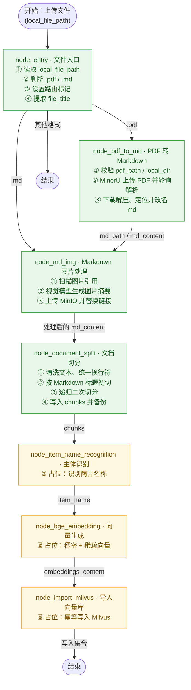

# RAG_Thinktank

RAG（Retrieval-Augmented Generation）检索增强生成，是当前大模型企业级应用的主流架构。

传统大模型仅依靠训练知识回答问题，在陌生领域、私有业务、实时信息等场景下容易出现事实幻觉、答案不准确、引用不可靠等问题。RAG 通过 **“先检索、再生成”**的方式，让大模型在回答前先从外部知识库中查找相关事实材料，再基于真实资料生成答案，从根源上提升回答的准确性、可信度与可追溯性 。

## 导入模块原型图（Import Pipeline）

> 导入模块由 LangGraph 编排，把上传的 PDF/Markdown 文档逐步加工为可检索的切片（chunks），最终写入 Milvus。绿色节点为已实现，黄色节点为待实现。

## 1. node_entry — 入口节点

1. 接收状态，获取 `local_file_path`（为空则告警并返回）；
2. 判断文件类型：`.pdf` / `.md` / 其他不支持格式；
3. 设置路由标记并记录路径：`is_pdf_read_enabled` 或 `is_md_read_enabled`；
4. 提取 `file_title`（文件名去掉后缀），作为后续识别的兜底。

> 注：函数体首尾有 `add_running_task` / `add_done_task` 记录任务状态。

## 2. node_pdf_to_md — PDF 转 Markdown

1. **步骤1：路径校验** — 校验 `pdf_path`、`local_dir`（不存在则自动创建）；
2. **步骤2：通过 MinerU 将 pdf 转换为 md** — 获取上传链接 → 上传 PDF → 轮询解析结果直到完成；
3. **步骤3：下载压缩包并解压** — 找到 md 文件、统一改名，然后更新 `state["md_path"]` 并把全文读入 `state["md_content"]`。

## 3. node_md_img — Markdown 图片处理

1. **步骤1：核心参数校验** — 校验 `md_path` / `md_content`，返回 images 图片目录地址；
2. **步骤2：提取 md 文件中的图片** — 扫描图片文件并定位其在 md 中的引用；
3. **步骤3：图片内容总结** — 调用多模态模型总结每张图片，返回“图片名 → 摘要”；
4. **步骤4：上传图片到 MinIO 并替换** — 上传图片、把本地图片链接和描述替换为 ``，返回替换后的 md 内容；
5. **步骤5：备份新的 md 内容** — 写为 `原名_new.md`，并更新 `state["md_content"]` / `state["md_path"]`。

## 4. node_document_split — 文档切分

1. **步骤1：获取与清洗内容** — 取 `md_content` 和 `file_title`（file_title 做标题兜底），统一换行符；
2. **步骤2：通过标题进行初切** — 按 Markdown 标题切分，保证每段语义完整；
3. **步骤3：二次切分** — 用 `RecursiveCharacterTextSplitter`（200 字/重叠 20）控制切片大小；
4. **步骤4：数据备份和修改 state** — 写入 `state["chunks"]` 并备份成 JSON 文件。

## 5. node_item_name_recognition — 主体识别

1. **步骤1：校验和取值** — 获取 `file_title`、`chunks`；
2. **步骤2：构建上下文环境** — `chunks` → 取前 5 条 → 拼接成 context 文本；
3. **步骤3：调用模型** — 拼接提示词，识别 chunks 对应的 `item_name`；
4. **步骤4：产品主体回填** — 修改 state 中 chunks，回填 `item_name`；
5. **步骤5：生成向量** — 为 `item_name` 生成稠密/稀疏向量；
6. **步骤6：存储到向量数据库** — 写入 `kb_item_name`（含 id / file_title / item_name / 稠密和稀疏向量）。
