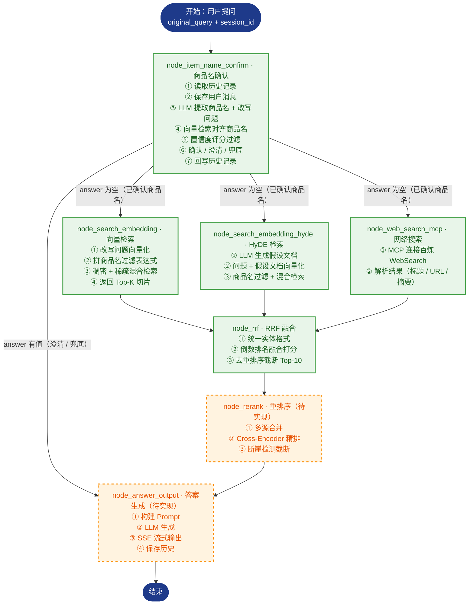

# RAG_Thinktank · 掌柜智库

> 面向企业产品文档的 RAG（Retrieval-Augmented Generation）智能知识库系统，由 LangGraph 编排**导入（Import）**与**检索（Query）**两条流水线。导入管线把 PDF / Markdown 文档加工为可检索切片（chunks），生成稠密 + 稀疏混合向量并写入 Milvus；检索管线采用多路召回（向量 / HyDE / 网络搜索并行）→ RRF 融合 → 重排序 → 答案生成的策略，实现"先检索、再生成"的精准问答。

[](https://github.com/python/cpython)
[](https://github.com/langchain-ai/langgraph)
[](https://github.com/milvus-io/milvus)
[](https://huggingface.co/collections/BAAI/bge)
[](https://fastapi.tiangolo.com/)
[](https://github.com/minio/minio)

## 目录

- [项目简介](#项目简介)
- [核心特性](#核心特性)
- [技术栈](#技术栈)
- [目录结构](#目录结构)
- [导入管线（Import Pipeline）](#导入管线import-pipeline)
- [检索管线（Query Pipeline）](#检索管线query-pipeline)
- [快速开始](#快速开始quick-start)
- [环境变量配置](#环境变量配置)
- [测试](#测试)
- [已知限制与路线图](#已知限制与路线图)
- [附录：导入节点分步说明](#附录导入节点分步说明)
- [附录：检索节点分步说明](#附录检索节点分步说明)

## 项目简介

​		RAG_Thinktank（掌柜智库）是一个面向企业产品文档的 RAG 智能知识库系统，提供文档自动化导入与智能问答两大核心能力。RAG（检索增强生成）的核心是"先检索、再生成"三步：**Retrieval（检索）** 将用户问题转换为向量，在向量库中检索相似文档 → **Augmented（增强）** 把检索到的文档作为上下文，与问题一起构建 Prompt → **Generation（生成）** 由 LLM 基于增强后的 Prompt 生成答案。相比仅依赖训练知识回答问题的大模型，RAG 让回答建立在真实文档内容之上，从根本上缓解了事实幻觉、答案不准确、引用不可靠等问题。

​		本项目代码位于 `knowledge_base/`，当前完成阶段：**导入模块七个节点全部实现并测试通过**；**检索模块已完成商品名确认、多路召回、RRF 融合五个节点**，重排序与答案生成节点待完善。

## 核心特性

### 导入模块（Import Pipeline）

- **LangGraph 有状态编排**：`StateGraph` + 条件路由，PDF / Markdown 双入口自动分流
- **PDF 结构化解析**：接入 MinerU 在线 API（上传 → 轮询 → 下载解压 → 统一命名），保留表格 / 公式 / 图片
- **图片语义化**：Qwen3-VL-Flash 视觉模型对图片生成描述摘要，图片上传 MinIO，Markdown 引用替换为 ``
- **标题感知切分**：先按 Markdown 标题（1–6 级）初切，再用 `RecursiveCharacterTextSplitter`（200 字 / 重叠 20）二次切分，注入 `title` / `parent_title` / `file_title` / `part` 元数据，chunks 落盘备份
- **商品主体识别**：LLM 从文档前几个 chunk 拼接上下文识别商品名称（`item_name`），回填每个 chunk
- **稠密 + 稀疏混合向量**：BGE-M3 生成 1024 维稠密向量（语义）与稀疏向量（词袋，精确关键词匹配）
- **幂等入库**：按 `item_name` 先删后插、批量写入，Milvus 集合自动创建

### 检索模块（Query Pipeline）

- **商品名智能确认**：LLM 提取商品名 + 问题改写（含代词指代消解）→ 向量对齐（Milvus 检索标准名称）→ 置信度分级（≥0.85 直接确认 / 0.6~0.85 候选澄清 / <0.6 提示重输）
- **多路召回并行**：向量检索（混合检索）+ HyDE 假设文档检索 + MCP 网络搜索三路并发执行，提升召回率
- **RRF 融合排序**：倒数排名融合（Reciprocal Rank Fusion）合并向量与 HyDE 两路结果，去重排序截断 Top-10
- **历史对话管理**：MongoDB 按 `session_id` 关联多轮对话，商品名延迟回填补全历史记录
- **SSE 流式推送**：FastAPI 后台任务 + `asyncio.Queue`，实时推送检索进度与答案生成过程

## 技术栈

| 类别         | 选型                                                              | 状态     |
| ------------ | ----------------------------------------------------------------- | -------- |
| 语言 / 环境  | Python ≥ 3.11，uv 包管理（`uv.lock` 已提交）                      | 已交付   |
| 工作流       | LangGraph + LangChain（状态管理 + 条件路由 + 并发编排）           | 已交付   |
| 文档解析     | MinerU（PDF → Markdown，保留表格 / 公式 / 图片）                  | 已交付   |
| 视觉模型     | 通义千问 Qwen3-VL-Flash（图片描述生成）                           | 已交付   |
| 向量模型     | BGE-M3（1024 维稠密 + 稀疏混合向量）                              | 已交付   |
| 向量数据库   | Milvus（混合检索，WeightedRanker 加权融合）                       | 已交付   |
| 对象存储     | MinIO（原始文档 + 图片）                                          | 已交付   |
| LLM 接入     | 通义千问 Qwen-Flash（阿里云百炼 DashScope，OpenAI 兼容模式）      | 已交付   |
| 日志         | loguru                                                            | 已交付   |
| 后端框架     | FastAPI + Uvicorn（异步、原生 SSE 流式响应）                      | 已交付   |
| 文档数据库   | MongoDB（历史对话记录管理 + 商品名延迟回填）                      | 已交付   |
| 网络搜索     | 百炼 WebSearch（DashScope，经 MCP 协议调用）                      | 已交付   |
| 重排序模型   | BGE-Reranker-large（Cross-Encoder 精排 + 断崖检测截断）           | 待接入   |
| 前端         | 原生 HTML + JavaScript + EventSource（SSE 流式接收）              | 待完善   |

## 目录结构

```text
RAG_Thinktank/
├── README.md
├── .gitignore
└── knowledge_base/                # 项目主体（在此目录执行 uv 命令）
    ├── pyproject.toml             # 依赖与项目元信息
    ├── uv.lock                    # 锁定版本（提交，可复现环境）
    ├── .env.example               # 环境变量模板（提交）
    ├── app/
    │   ├── import_process/        # ★ 导入模块
    │   │   ├── agent/
    │   │   │   ├── state.py       # LangGraph 状态定义
    │   │   │   ├── main_graph.py  # 图编排（条件路由 + 7 节点）
    │   │   │   └── nodes/         # 7 个导入节点
    │   │   └── api/               # 文件导入服务
    │   ├── query_process/         # ★ 检索模块
    │   │   ├── agent/
    │   │   │   ├── state.py       # 查询状态定义（QueryGraphState）
    │   │   │   ├── main_graph.py  # 图编排（条件路由 + 三路并行 + 7 节点）
    │   │   │   └── nodes/         # 7 个检索节点
    │   │   ├── api/               # 查询服务（FastAPI + SSE）
    │   │   └── page/              # chat.html 问答页
    │   ├── clients/               # Milvus / MinIO / Mongo 客户端封装
    │   ├── conf/                  # 各服务配置类（读取 .env）
    │   ├── core/                  # logger、load_prompt
    │   ├── lm/                    # LLM / BGE-M3 / reranker 封装
    │   ├── sse/                   # SSE 教学示例（step1~step5）
    │   ├── tool/                  # 模型下载脚本
    │   └── utils/                 # 路径、限流、任务进度等工具
    ├── prompts/                   # .prompt 提示词模板
    ├── test/                      # 环境验证与导入测试（01~06）
    ├── doc/                       # 输入文档池（Git 忽略，clone 后自建）
    ├── output/                    # 处理产物（Git 忽略，clone 后自建）
    └── logs/                      # 运行日志（Git 忽略）
```

## 导入管线（Import Pipeline）


| #    | 节点                       | 职责            | 关键产物 / 动作                                              |
| ---- | -------------------------- | --------------- | ------------------------------------------------------------ |
| 1    | node_entry                 | 文件入口        | 判断 `.pdf` / `.md`，设置路由标记，提取 `file_title`         |
| 2    | node_pdf_to_md             | PDF 转 Markdown | MinerU 上传解析、轮询、解压取 md                             |
| 3    | node_md_img                | 图片处理        | 图片摘要 + 上传 MinIO + 替换 Markdown 链接                   |
| 4    | node_document_split        | 文档切分        | 标题初切 + 递归二次切分 → `chunks`（备份 JSON）              |
| 5    | node_item_name_recognition | 主体识别        | LLM 识别商品名，回填 chunk，写入 `kb_item_names`             |
| 6    | node_bge_embedding         | 向量生成        | BGE-M3 批量生成稠密 + 稀疏向量                               |
| 7    | node_import_milvus         | 导入向量库      | 建 `kb_chunks`、按 `item_name` 幂等删旧、插入并回填 `chunk_id` |

## 检索管线（Query Pipeline）

> 检索管线的核心是**多路召回**：用户问题先经过商品名确认，再并行分发到向量检索、HyDE 检索、网络搜索三条支路，汇合后经 RRF 融合与重排序，最终生成答案。`node_rerank` 与 `node_answer_output` 两个节点当前为占位实现（见下方橙色标注），其余五个节点已完整实现。



| #    | 节点                     | 职责                    | 关键产物 / 动作                                                  | 状态   |
| ---- | ------------------------ | ----------------------- | ---------------------------------------------------------------- | ------ |
| 1    | node_item_name_confirm   | 商品名确认              | 历史记录 → LLM 提取 + 改写 → 向量对齐 → 评分过滤 → 确认 / 澄清 | 已实现 |
| 2    | node_search_embedding    | 向量检索                | 改写问题向量化 + 商品名过滤 → 混合检索 `kb_chunks`               | 已实现 |
| 3    | node_search_embedding_hyde | HyDE 检索             | LLM 生成假设文档 → 问题 + 假设文档向量化 → 混合检索              | 已实现 |
| 4    | node_web_search_mcp      | 网络搜索                | MCP 调用百炼 WebSearch → 解析 title / url / snippet              | 已实现 |
| 5    | node_rrf                 | RRF 融合                | 向量 + HyDE 两路倒数排名融合 → 去重排序 Top-10                   | 已实现 |
| 6    | node_rerank              | 重排序                  | Cross-Encoder 精排 + 断崖检测截断                                | 待实现 |
| 7    | node_answer_output       | 答案生成                | 构建 Prompt → LLM 生成 → SSE 流式输出 → 保存历史                 | 待实现 |

## 快速开始（Quick Start）

> 环境要求：Python ≥ 3.11、uv、可访问的 Milvus、MinIO 与 MongoDB 服务。

### 1. 安装 uv（已安装可跳过）

```powershell
# Windows（PowerShell）
powershell -ExecutionPolicy ByPass -c "irm https://astral.sh/uv/install.ps1 | iex"
```

```bash
# macOS / Linux
curl -LsSf https://astral.sh/uv/install.sh | sh
```

### 2. 还原依赖环境

```bash
cd knowledge_base
uv sync --frozen   # 依据已提交的 uv.lock 安装锁定版本
```

> 本机没有 Python 3.11+ 时，先执行 `uv python install 3.11`。

### 3. 配置环境变量

```bash
# Windows
Copy-Item .env.example .env
# macOS / Linux
cp .env.example .env
```

打开 `.env` 按注释填写，至少确认：

- 百炼 LLM：`OPENAI_API_KEY`、`OPENAI_BASE_URL`、`LLM_DEFAULT_MODEL`、`VL_MODEL`（图片摘要用视觉模型）
- MinerU：`MINERU_API_TOKEN`（PDF 入口必需）
- Milvus：`MILVUS_URL`（默认 `http://localhost:19530`）
- MinIO：`MINIO_ENDPOINT` 填 `IP:9000`，**不带 http://，且不是 9001 控制台端口**
- BGE-M3：`BGE_M3_PATH` 指向本地模型；留空则首次运行自动下载
- MongoDB：`MONGO_URL`（检索模块历史对话必需）
- 重排序（预留）：`BGE_RERANKER_LARGE` 指向本地 BGE-Reranker-large 模型

### 4. 准备输入文档

`doc/` 与 `output/` 已被 Git 忽略，clone 后需要手动创建：

```powershell
New-Item -ItemType Directory doc, output
```

将待处理的 PDF / Markdown 文件放入 `doc/`。

### 5. 验证环境

```bash
uv run python test/01_llm_test.py      # 大模型连通性
uv run python test/05_bgem3_test.py    # BGE-M3 稠密/稀疏向量
uv run python test/06_import_test.py   # 全链路：PDF → chunks → Milvus
```

> `06_import_test.py` 默认读取 `doc/hak180使用说明书.pdf`，文件名不同请自行调整。

### 6. 代码方式调用导入管线

```python
from app.import_process.agent.main_graph import kb_import_app
from app.import_process.agent.state import create_default_state

state = create_default_state(
    task_id="demo_001",
    local_file_path="doc/hak180使用说明书.pdf",  # 相对 knowledge_base 目录
    local_dir="output",
)
result = kb_import_app.invoke(state)

print("识别主体：", result["item_name"])
print("切片数量：", len(result["chunks"]))
```

### 7. 代码方式调用检索管线

```python
from app.query_process.agent.main_graph import kb_query_app
from app.query_process.agent.state import create_query_default_state

state = create_query_default_state(
    session_id="demo_001",
    original_query="HAK 180 烫金机怎么操作？",
)
result = kb_query_app.invoke(state)

print("确认商品名：", result["item_names"])
print("重写后问题：", result["rewritten_query"])
```

### 8. 启动检索服务（FastAPI + SSE）

```bash
# 在 knowledge_base 目录下执行（-m 方式才会把项目根加入 sys.path，能 import app.*）
uv run python -m app.query_process.api.query_service
# 服务监听 http://127.0.0.1:9091

# 启动后，务必通过该服务本身打开问答页面（同源，最稳妥）：
#   http://127.0.0.1:9091/chat.html
```

> 页面内的 `API_BASE` 只会把 **9091 同源** 视为后端；其余情况（IDE 内置预览、静态服务器、`file://`）
> 一律回退到 `chat.html` 顶部的 `API_HOST`（默认 `http://127.0.0.1:9091`）。
> 所以：要么用 `http://127.0.0.1:9091/chat.html` 打开，要么保证 `API_HOST` 与实际服务端口一致，
> 否则请求会打到“提供页面的那台服务器”上并返回它的 HTML 404（右上角显示“API: 未连接”）。

| 接口                      | 方法   | 说明                                             |
| ------------------------- | ------ | ------------------------------------------------ |
| `/query`                  | POST   | 提交查询（`is_stream=true` 走后台任务 + SSE）    |
| `/stream/{session_id}`    | GET    | 建立 SSE 连接，实时接收进度与答案                |
| `/history/{session_id}`   | GET    | 查询最近历史对话                                 |
| `/history/{session_id}`   | DELETE | 清空会话历史                                     |
| `/health`                 | GET    | 健康检查                                         |
| `/chat.html`              | GET    | 问答页面                                         |

### 9. 查看处理结果

- `output/<file_title>/backup.json`：chunks 备份
- `output/<file_title>/xxx_new.md`：图片替换后的 Markdown
- Milvus：`kb_item_names`（主体向量）、`kb_chunks`（切片向量与元数据）
- MongoDB：历史对话记录（`session_id` 关联，含 `item_names` / `rewritten_query` 回填）

## 环境变量配置

各配置项均以 `knowledge_base/.env.example` 为准，此处为概要：

| 配置区块    | 是否必需        | 关键变量                                                     | 说明                   |
| ----------- | --------------- | ------------------------------------------------------------ | ---------------------- |
| LLM（百炼） | 必需            | `OPENAI_API_KEY` `OPENAI_BASE_URL` `LLM_DEFAULT_MODEL` `VL_MODEL` | 文本 / 视觉模型        |
| MinerU      | PDF 入口必需    | `MINERU_API_TOKEN` `MINERU_BASE_URL`                         | PDF 转 Markdown        |
| Milvus      | 必需            | `MILVUS_URL` `CHUNKS_COLLECTION` `ITEM_NAME_COLLECTION` `EMBEDDING_DIM` | 向量库与集合名         |
| BGE-M3      | 必需            | `BGE_M3_PATH` `BGE_DEVICE` `BGE_FP16`                        | 本地模型路径或在线兜底 |
| MinIO       | md 含图片时必需 | `MINIO_ENDPOINT` `MINIO_ACCESS_KEY` `MINIO_SECRET_KEY` `MINIO_BUCKET_NAME` `MINIO_IMG_DIR` `MINIO_SECURE` | 图片对象存储           |
| MongoDB     | 检索模块必需    | `MONGO_URL` `MONGO_DB` `MONGO_COLLECTION`                    | 历史对话记录           |
| Reranker    | 重排序预留      | `BGE_RERANKER_LARGE` `BGE_RERANKER_DEVICE` `BGE_RERANKER_FP16` | Cross-Encoder 精排模型 |
| 网络搜索    | 网络检索必需    | `MCP_DASHSCOPE_BASE_URL` `DASHSCOPE_API_KEY`                 | 百炼 WebSearch（MCP）  |
| 日志        | 可选            | `LOG_CONSOLE_*` `LOG_FILE_*`                                 | 控制台 / 文件日志      |
| 预留        | 可选            | `NEO4J_*`                                                    | 知识图谱后续使用       |

## 测试

| 脚本                     | 验证内容                   | 前置条件               |
| ------------------------ | -------------------------- | ---------------------- |
| `test/01_llm_test.py`    | LLM 连通性                 | `.env` 已配置          |
| `test/02_path_test.py`   | Path 路径基础（教学）      | 无                     |
| `test/03_cuda_test.py`   | CUDA / torch 环境          | 无                     |
| `test/04_regex_test.py`  | 正则基础（教学）           | 无                     |
| `test/05_bgem3_test.py`  | BGE-M3 稠密 / 稀疏向量生成 | 模型路径或联网         |
| `test/06_import_test.py` | 全链路 PDF → Milvus 入库   | 服务 + `doc/` 测试文件 |

每个节点文件（`app/import_process/agent/nodes/*.py` 与 `app/query_process/agent/nodes/*.py`）都自带 `if __name__ == "__main__"` 单元测试入口，可单独运行单节点验证。检索模块各节点依赖 Milvus / MongoDB / 百炼服务，运行前需确保对应服务可用。

## 已知限制与路线图

**已知限制**

- 检索模块已完成商品名确认、三路召回、RRF 融合五个节点；`node_rerank`（重排序）与 `node_answer_output`（答案生成）当前为占位实现，尚未接入业务；
- RRF 融合当前仅合并向量检索 + HyDE 检索两路结果，网络搜索结果预留至重排序阶段做多源合并；
- Neo4j 仅完成配置预留，尚未接入知识图谱；
- `doc/`、`output/`、`logs/` 为本地数据，clone 后需要手动创建；
- BGE-M3 / 模型缓存依赖本地路径或首次联网下载。

**路线图**

- [x] 导入模块七节点闭环（PDF/MD → chunks → Milvus）
- [x] 检索模块：商品名确认（LLM 提取 + 向量对齐 + 评分过滤）→ 三路召回（向量 / HyDE / 网络搜索并行）→ RRF 融合
- [ ] 检索模块：重排序（Cross-Encoder 精排 + 断崖检测截断）→ 答案生成（Prompt 构建 + SSE 流式 + 图片提取）
- [ ] Web 服务完善与前端问答界面打磨
- [ ] 知识图谱扩展（Neo4j）

## 附录：导入节点分步说明

### 1. node_entry — 入口节点

1. 接收状态，获取 `local_file_path`（为空则告警并返回）；
2. 判断文件类型：`.pdf` / `.md` / 其他不支持格式；
3. 设置路由标记并记录路径：`is_pdf_read_enabled` / `is_md_read_enabled`，对应写入 `pdf_path` / `md_path`；
4. 提取 `file_title`（文件名去掉后缀），作为后续识别的兜底。

> 节点首尾通过 `add_running_task` / `add_done_task` 记录任务进度。

### 2. node_pdf_to_md — PDF 转 Markdown

1. **步骤1：路径校验** — 校验 `pdf_path`、`local_dir`（不存在则自动创建）；
2. **步骤2：通过 MinerU 将 pdf 转换为 md** — 获取上传链接 → 上传 PDF → 轮询解析结果直到完成；
3. **步骤3：下载压缩包并解压** — 找到 md 文件、统一改名，更新 `state["md_path"]` 并把全文读入 `state["md_content"]`。

### 3. node_md_img — Markdown 图片处理

1. **步骤1：核心参数校验** — 校验 `md_path` / `md_content`，返回 images 图片目录；
2. **步骤2：提取 md 文件中的图片** — 扫描图片文件并定位其在 md 中的引用；
3. **步骤3：图片内容总结** — 调用 Qwen3-VL-Flash 多模态模型生成图片摘要（带前后文、限流保护）；
4. **步骤4：上传图片到 MinIO 并替换** — 上传图片，替换为 ``；
5. **步骤5：备份新的 md 内容** — 另存 `原名_new.md`，更新 `state["md_content"]` / `state["md_path"]`。

### 4. node_document_split — 文档切分

1. **步骤1：获取与清洗内容** — 取 `md_content` / `file_title`，统一换行符；
2. **步骤2：通过标题进行初切** — 按 Markdown 标题（1–6 级）切分（跳过代码块），保证语义完整；
3. **步骤3：二次切分** — 用 `RecursiveCharacterTextSplitter`（200 字 / 重叠 20）控制切片大小；
4. **步骤4：注入元数据与备份** — 为每个 chunk 注入 `title` / `parent_title` / `file_title` / `part` 元数据，写入 `state["chunks"]`，并在 md 同目录备份为 JSON。

### 5. node_item_name_recognition — 主体识别

1. **步骤1：校验和取值** — 获取 `file_title`、`chunks`（为空抛异常）；
2. **步骤2：构建上下文** — 取前 5 条切片拼接 context（总量受控）；
3. **步骤3：调用 LLM** — 加载 `item_name_recognition` 与系统提示词，识别 `item_name`（失败兜底为文件名）；
4. **步骤4：主体回填** — 为每个 chunk 写入 `item_name` 并更新 state；
5. **步骤5：生成向量** — 对 `item_name` 生成稠密 / 稀疏向量；
6. **步骤6：写入向量库** — 自动创建集合并按 `item_name` 幂等清理后写入 `kb_item_names`。

### 6. node_bge_embedding — 向量生成

1. **步骤1：输入校验** — 校验 `state["chunks"]` 非空；
2. **步骤2：批量生成双向量** — 每 5 条一批，文本格式为“商品：{item_name}，介绍：{content}”，BGE-M3 生成稠密 + 稀疏向量并回填到每个 chunk。

### 7. node_import_milvus — 导入向量库

1. **步骤1：校验数据** — 校验 `chunks` 非空；
2. **步骤2：准备集合** — 不存在则创建 `kb_chunks`（含 content / title / parent_title / part / file_title / item_name / dense / sparse，稠密 HNSW-COSINE、稀疏 SPARSE_INVERTED_INDEX-IP）；
3. **步骤3：删除旧数据** — 按 `item_name` 幂等删除并重新加载集合；
4. **步骤4：插入新数据** — 批量写入 Milvus，将返回的 `chunk_id` 回填到各 chunk。

## 附录：检索节点分步说明

### 1. node_item_name_confirm — 商品名确认

1. **步骤1：获取历史记录** — 按 `session_id` 从 MongoDB 读取近期对话，写入 `state["history"]`；
2. **步骤2：保存用户消息** — 将原始问题以 `user` 角色写入 MongoDB，返回 `message_id`；
3. **步骤3：提取商品名 + 改写问题** — 加载 `rewritten_query_and_itemnames` 提示词，结合历史做**指代消解**（如“这个怎么用？”→“Brother HAK180 烫金机怎么用？”），LLM 返回 `item_names` 与 `rewritten_query`；
4. **步骤4：向量检索对齐** — 将 `item_names` 向量化，在 `kb_item_names` 集合做混合检索（稠密:稀疏 = 0.8:0.2，归一化，Top-5），返回真实商品名与相似分数；
5. **步骤5：评分对齐** — 按置信度分级：分数 ≥ 0.85 直接确认；0.6 ~ 0.85 进入待确认候选；< 0.6 丢弃；
6. **步骤6：确认检查** — 有确认结果则回填历史 `item_names` 并更新状态；仅有候选则生成澄清问句（“您是想问以下哪个产品：…？”）；均无则返回兜底提示；
7. **步骤7：回写历史** — 更新该条用户消息的 `rewritten_query` 与 `item_names`（指定 `message_id` 覆盖而非新增）。

### 2. node_search_embedding — 向量检索

1. **校验商品名** — `item_names` 为空则告警并返回空结果；
2. **改写问题向量化** — 用 BGE-M3 将 `rewritten_query` 生成稠密 + 稀疏向量；
3. **拼商品名过滤表达式** — 构造 `item_name in ['商品A', '商品B']`，限定只在指定产品切片内检索；
4. **混合检索** — 稠密（COSINE）+ 稀疏（IP）双路搜索 `kb_chunks`，WeightedRanker 加权融合（0.8:0.2，归一化），返回 Top-5 切片；
5. **输出** — 回填 `embedding_chunks`（含 `chunk_id` / `content` / `item_name`）。

### 3. node_search_embedding_hyde — HyDE 检索

1. **步骤1：生成假设文档** — 加载 `hyde_prompt`，让 LLM 根据改写后问题生成一段“理想答案范文”（≤300 字）；
2. **步骤2：组合向量化 + 混合检索** — 将“改写问题 + 假设文档”拼接后向量化，叠加商品名过滤，混合检索 `kb_chunks`（req_limit=10、limit=5）；
3. **兜底** — `rewritten_query` 为空则退回 `original_query`；生成或检索异常返回空结果。

### 4. node_web_search_mcp — 网络搜索

1. **校验改写问题** — `rewritten_query` 为空则跳过；
2. **MCP 调用** — 通过 `MCPServerStreamableHttp` 连接百炼 MCP 服务，调用 `bailian_web_search` 工具（count=5，最多重试 2 次）；
3. **结果解析** — 将返回 JSON 的 `pages` 字段整理为统一结构（`title` / `url` / `snippet`）；
4. **输出** — 回填 `web_search_docs`，作为本地知识库外的时效性补充。

### 5. node_rrf — RRF 融合

1. **步骤1：统一实体格式** — 将 Milvus 返回的 Hit 对象 / 字典统一转换为只含实体信息的字典列表；
2. **步骤2：倒数排名融合** — 对向量检索与 HyDE 检索两路结果按公式 `score(d) = Σ weight_i / (k + rank_i(d))` 累加打分（两路权重均为 1.0，k=60），同一 chunk 多路命中则分数累加；
3. **步骤3：去重排序截断** — 按综合得分降序排列，截断保留 Top-10，回填 `rrf_chunks`。

### 6. node_rerank — 重排序（待实现）

> 设计意图（对应封装 `lm/reranker_utils.py` 与面试标答）：

1. **多源合并** — 将 RRF 融合的本地切片与网络搜索结果统一为同一格式；
2. **精排打分** — 用 BGE-Reranker-large（Cross-Encoder）对每个文档与问题做精确相关度打分；
3. **断崖检测截断** — 按分数降序后逐对检查相邻分数差距，绝对差距 ≥ 0.5 或相对差距 ≥ 25% 即判定“断崖”并截断，最少保留 3 条、最多 10 条。

### 7. node_answer_output — 答案生成（待实现）

> 设计意图（对应 `prompts/answer_out.prompt` 与面试标答）：

1. **构建 Prompt** — 将历史对话、检索资料（context）、商品信息（item_names）、用户问题组装进提示词，并要求“基于参考内容回答、不编造事实”；
2. **字符预算控制** — 上下文累加超 12000 字符即截断，避免超出大模型窗口；
3. **LLM 生成** — 调用 Qwen-Flash 生成答案（含 `temperature=0` 确定性输出）；
4. **流式输出** — 经 SSE 逐字推送给前端；
5. **图片提取** — 从切片文本中提取相关图片 URL，以 `【图片】` 区块追加在答案末尾；
6. **保存历史** — 将最终答案以 `assistant` 角色写入 MongoDB。
