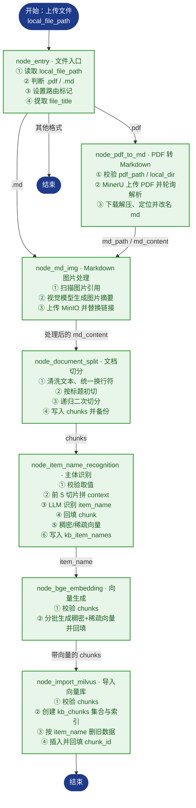

# RAG_Thinktank · 掌柜智库

> 面向产品手册的 RAG 知识库。当前交付**导入模块（Import Pipeline）**：由 LangGraph 编排，把 PDF/Markdown 文档逐步加工为可检索切片（chunks），生成稠密 + 稀疏混合向量并写入 Milvus，七个节点已全部实现并通过端到端测试。

[](https://github.com/python/cpython)
[](https://github.com/langchain-ai/langgraph)
[](https://github.com/milvus-io/milvus)
[](https://huggingface.co/collections/BAAI/bge)
[](https://github.com/minio/minio)

## 目录

- [项目简介](#项目简介)
- [核心特性](#核心特性)
- [技术栈](#技术栈)
- [目录结构](#目录结构)
- [导入管线（Import Pipeline）](#导入管线import-pipeline)
- [快速开始](#快速开始quick-start)
- [环境变量配置](#环境变量配置)
- [测试](#测试)
- [已知限制与路线图](#已知限制与路线图)
- [附录：导入节点分步说明](#附录导入节点分步说明)

## 项目简介

​		RAG_Thinktank(RAG智库)采用RAG（Retrieval-Augmented Generation）检索增强生成架构是当前大模型企业级应用的主流架构。传统大模型仅依靠训练知识回答问题，在陌生领域、私有业务、实时信息等场景下容易出现事实幻觉、答案不准确、引用不可靠等问题。RAG 通过“先检索、再生成”的方式，让大模型在回答前先从外部知识库查找相关事实材料，再基于真实资料生成答案，从而提升回答的准确性、可信度与可追溯性。

​		本项目代码位于 `knowledge_base/`，当前完成阶段：**导入模块七个节点全部实现并测试通过**。检索（Query）模块将在后续版本提供。

## 核心特性

- **LangGraph 有状态编排**：`StateGraph` + 条件路由，PDF / Markdown 双入口自动分流
- **PDF 结构化解析**：接入 MinerU 在线 API（上传 → 轮询 → 下载解压 → 统一命名）
- **图片语义化**：视觉模型对图片生成摘要，图片上传 MinIO，Markdown 引用替换为 ``
- **标题感知切分**：先按 Markdown 标题初切，再用 `RecursiveCharacterTextSplitter`（200 字 / 重叠 20）二次切分，chunks 落盘备份
- **商品主体识别**：LLM 从文档前几段识别商品名称（`item_name`），回填每个 chunk
- **稠密 + 稀疏混合向量**：BGE-M3 生成 1024 维稠密向量与稀疏向量（L2 归一化）
- **幂等入库**：按 `item_name` 先删后插，Milvus 集合自动创建
- **工程化基础**：uv 锁定依赖、loguru 日志、任务进度追踪、滑动窗口限流、提示词模板化管理

## 技术栈

| 类别        | 选型                                               |
| ----------- | -------------------------------------------------- |
| 语言 / 环境 | Python ≥ 3.11，uv 包管理（`uv.lock` 已提交）       |
| 工作流      | LangGraph + LangChain                              |
| 文档解析    | MinerU（PDF → Markdown）、多模态大模型（图片摘要） |
| 向量模型    | BGE-M3（稠密 + 稀疏混合）                          |
| 向量数据库  | Milvus                                             |
| 对象存储    | MinIO                                              |
| LLM 接入    | 阿里云百炼 DashScope（OpenAI 兼容模式）            |
| 日志        | loguru                                             |

## 目录结构

```text
RAG_Thinktank/
├── README.md
├── .gitignore
└── knowledge_base/                # 项目主体（在此目录执行 uv 命令）
    ├── pyproject.toml             # 依赖与项目元信息
    ├── uv.lock                    # 锁定版本（提交，可复现环境）
    ├── .env.example               # 环境变量模板（提交）
    ├── app/
    │   ├── import_process/        # ★ 导入模块
    │   │   ├── agent/
    │   │   │   ├── state.py       # LangGraph 状态定义
    │   │   │   ├── main_graph.py  # 图编排（条件路由 + 7 节点）
    │   │   │   └── nodes/         # 7 个节点实现
    │   ├── clients/               # Milvus / MinIO / Mongo 客户端封装
    │   ├── conf/                  # 各服务配置类（读取 .env）
    │   ├── core/                  # logger、load_prompt
    │   ├── lm/                    # LLM / BGE-M3 / reranker 封装
    │   ├── tool/                  # 模型下载脚本
    │   └── utils/                 # 路径、限流、任务进度等工具
    ├── prompts/                   # .prompt 提示词模板
    ├── test/                      # 环境验证与导入测试（01~06）
    ├── doc/                       # 输入文档池（Git 忽略，clone 后自建）
    ├── output/                    # 处理产物（Git 忽略，clone 后自建）
    └── logs/                      # 运行日志（Git 忽略）
```

## 导入管线（Import Pipeline）



| #    | 节点                       | 职责            | 关键产物 / 动作                                              |
| ---- | -------------------------- | --------------- | ------------------------------------------------------------ |
| 1    | node_entry                 | 文件入口        | 判断 `.pdf` / `.md`，设置路由标记，提取 `file_title`         |
| 2    | node_pdf_to_md             | PDF 转 Markdown | MinerU 上传解析、轮询、解压取 md                             |
| 3    | node_md_img                | 图片处理        | 图片摘要 + 上传 MinIO + 替换 Markdown 链接                   |
| 4    | node_document_split        | 文档切分        | 标题初切 + 递归二次切分 → `chunks`（备份 JSON）              |
| 5    | node_item_name_recognition | 主体识别        | LLM 识别商品名，回填 chunk，写入 `kb_item_names`             |
| 6    | node_bge_embedding         | 向量生成        | BGE-M3 批量生成稠密 + 稀疏向量                               |
| 7    | node_import_milvus         | 导入向量库      | 建 `kb_chunks`、按 `item_name` 幂等删旧、插入并回填 `chunk_id` |

## 快速开始（Quick Start）

> 环境要求：Python ≥ 3.11、uv、可访问的 Milvus 与 MinIO 服务。

### 1. 安装 uv（已安装可跳过）

```powershell
# Windows（PowerShell）
powershell -ExecutionPolicy ByPass -c "irm https://astral.sh/uv/install.ps1 | iex"
```

```bash
# macOS / Linux
curl -LsSf https://astral.sh/uv/install.sh | sh
```

### 2. 还原依赖环境

```bash
cd knowledge_base
uv sync --frozen   # 依据已提交的 uv.lock 安装锁定版本
```

> 本机没有 Python 3.11+ 时，先执行 `uv python install 3.11`。

### 3. 配置环境变量

```bash
# Windows
Copy-Item .env.example .env
# macOS / Linux
cp .env.example .env
```

打开 `.env` 按注释填写，至少确认：

- 百炼 LLM：`OPENAI_API_KEY`、`OPENAI_BASE_URL`、`LLM_DEFAULT_MODEL`、`VL_MODEL`（图片摘要用视觉模型）
- MinerU：`MINERU_API_TOKEN`（PDF 入口必需）
- Milvus：`MILVUS_URL`（默认 `http://localhost:19530`）
- MinIO：`MINIO_ENDPOINT` 填 `IP:9000`，**不带 http://，且不是 9001 控制台端口**
- BGE-M3：`BGE_M3_PATH` 指向本地模型；留空则首次运行自动下载

### 4. 准备输入文档

`doc/` 与 `output/` 已被 Git 忽略，clone 后需要手动创建：

```powershell
New-Item -ItemType Directory doc, output
```

将待处理的 PDF / Markdown 文件放入 `doc/`。

### 5. 验证环境

```bash
uv run python test/01_llm_test.py      # 大模型连通性
uv run python test/05_bgem3_test.py    # BGE-M3 稠密/稀疏向量
uv run python test/06_import_test.py   # 全链路：PDF → chunks → Milvus
```

> `06_import_test.py` 默认读取 `doc/hak180使用说明书.pdf`，文件名不同请自行调整。

### 6. 代码方式调用导入管线

```python
from app.import_process.agent.main_graph import kb_import_app
from app.import_process.agent.state import create_default_state

state = create_default_state(
    task_id="demo_001",
    local_file_path="doc/hak180使用说明书.pdf",  # 相对 knowledge_base 目录
    local_dir="output",
)
result = kb_import_app.invoke(state)

print("识别主体：", result["item_name"])
print("切片数量：", len(result["chunks"]))
```

### 7. 查看处理结果

- `output/<file_title>/backup.json`：chunks 备份
- `output/<file_title>/xxx_new.md`：图片替换后的 Markdown
- Milvus：`kb_item_names`（主体向量）、`kb_chunks`（切片向量与元数据）

## 环境变量配置

各配置项均以 `knowledge_base/.env.example` 为准，此处为概要：

| 配置区块    | 是否必需        | 关键变量                                                     | 说明                   |
| ----------- | --------------- | ------------------------------------------------------------ | ---------------------- |
| LLM（百炼） | 必需            | `OPENAI_API_KEY` `OPENAI_BASE_URL` `LLM_DEFAULT_MODEL` `VL_MODEL` | 文本 / 视觉模型        |
| MinerU      | PDF 入口必需    | `MINERU_API_TOKEN` `MINERU_BASE_URL`                         | PDF 转 Markdown        |
| Milvus      | 必需            | `MILVUS_URL` `CHUNKS_COLLECTION` `ITEM_NAME_COLLECTION` `EMBEDDING_DIM` | 向量库与集合名         |
| BGE-M3      | 必需            | `BGE_M3_PATH` `BGE_DEVICE` `BGE_FP16`                        | 本地模型路径或在线兜底 |
| MinIO       | md 含图片时必需 | `MINIO_ENDPOINT` `MINIO_ACCESS_KEY` `MINIO_SECRET_KEY` `MINIO_BUCKET_NAME` `MINIO_IMG_DIR` `MINIO_SECURE` | 图片对象存储           |
| 日志        | 可选            | `LOG_CONSOLE_*` `LOG_FILE_*`                                 | 控制台 / 文件日志      |
| 预留        | 可选            | `NEO4J_*` `MONGO_*` `BGE_RERANKER_*` `MCP_DASHSCOPE_BASE_URL` | 检索模块后续使用       |

## 测试

| 脚本                     | 验证内容                   | 前置条件               |
| ------------------------ | -------------------------- | ---------------------- |
| `test/01_llm_test.py`    | LLM 连通性                 | `.env` 已配置          |
| `test/02_path_test.py`   | Path 路径基础（教学）      | 无                     |
| `test/03_cuda_test.py`   | CUDA / torch 环境          | 无                     |
| `test/04_regex_test.py`  | 正则基础（教学）           | 无                     |
| `test/05_bgem3_test.py`  | BGE-M3 稠密 / 稀疏向量生成 | 模型路径或联网         |
| `test/06_import_test.py` | 全链路 PDF → Milvus 入库   | 服务 + `doc/` 测试文件 |

每个节点文件（`app/import_process/agent/nodes/*.py`）也自带 `if __name__ == "__main__"` 单元测试入口，可直接运行单节点验证。

## 已知限制与路线图

**已知限制**

- 本版本交付导入模块；检索（Query）模块未实现；
- Neo4j、MongoDB、Reranker、WebSearch（MCP）仅完成配置与客户端预留，尚未接入业务；
- `doc/`、`output/`、`logs/` 为本地数据，clone 后需要手动创建；
- BGE-M3 / 模型缓存依赖本地路径或首次联网下载。

**路线图**

- [ ] 导入模块七节点闭环（PDF/MD → chunks → Milvus）
- [ ] 检索模块：多路召回（稠密 / 稀疏 / HyDE）、RRF 融合、Rerank、答案生成
- [ ] Web 服务与流式进度推送
- [ ] 知识图谱与历史记录扩展

## 附录：导入节点分步说明

### 1. node_entry — 入口节点

1. 接收状态，获取 `local_file_path`（为空则告警并返回）；
2. 判断文件类型：`.pdf` / `.md` / 其他不支持格式；
3. 设置路由标记并记录路径：`is_pdf_read_enabled` / `is_md_read_enabled`，对应写入 `pdf_path` / `md_path`；
4. 提取 `file_title`（文件名去掉后缀），作为后续识别的兜底。

> 节点首尾通过 `add_running_task` / `add_done_task` 记录任务进度。

### 2. node_pdf_to_md — PDF 转 Markdown

1. **步骤1：路径校验** — 校验 `pdf_path`、`local_dir`（不存在则自动创建）；
2. **步骤2：通过 MinerU 将 pdf 转换为 md** — 获取上传链接 → 上传 PDF → 轮询解析结果直到完成；
3. **步骤3：下载压缩包并解压** — 找到 md 文件、统一改名，更新 `state["md_path"]` 并把全文读入 `state["md_content"]`。

### 3. node_md_img — Markdown 图片处理

1. **步骤1：核心参数校验** — 校验 `md_path` / `md_content`，返回 images 图片目录；
2. **步骤2：提取 md 文件中的图片** — 扫描图片文件并定位其在 md 中的引用；
3. **步骤3：图片内容总结** — 调用多模态模型生成图片摘要（带前后文、限流保护）；
4. **步骤4：上传图片到 MinIO 并替换** — 上传图片，替换为 ``；
5. **步骤5：备份新的 md 内容** — 另存 `原名_new.md`，更新 `state["md_content"]` / `state["md_path"]`。

### 4. node_document_split — 文档切分

1. **步骤1：获取与清洗内容** — 取 `md_content` / `file_title`，统一换行符；
2. **步骤2：通过标题进行初切** — 按 Markdown 标题切分（跳过代码块），保证语义完整；
3. **步骤3：二次切分** — 用 `RecursiveCharacterTextSplitter`（200 字 / 重叠 20）控制切片大小；
4. **步骤4：数据备份与写回 state** — 写入 `state["chunks"]`，并在 md 同目录备份为 JSON。

### 5. node_item_name_recognition — 主体识别

1. **步骤1：校验和取值** — 获取 `file_title`、`chunks`（为空抛异常）；
2. **步骤2：构建上下文** — 取前 5 条切片拼接 context（总量受控）；
3. **步骤3：调用 LLM** — 加载 `item_name_recognition` 与系统提示词，识别 `item_name`（失败兜底为文件名）；
4. **步骤4：主体回填** — 为每个 chunk 写入 `item_name` 并更新 state；
5. **步骤5：生成向量** — 对 `item_name` 生成稠密 / 稀疏向量；
6. **步骤6：写入向量库** — 自动创建集合并按 `item_name` 幂等清理后写入 `kb_item_names`。

### 6. node_bge_embedding — 向量生成

1. **步骤1：输入校验** — 校验 `state["chunks"]` 非空；
2. **步骤2：批量生成双向量** — 每 5 条一批，文本格式为“商品：{item_name}，介绍：{content}”，BGE-M3 生成稠密 + 稀疏向量并回填到每个 chunk。

### 7. node_import_milvus — 导入向量库

1. **步骤1：校验数据** — 校验 `chunks` 非空；
2. **步骤2：准备集合** — 不存在则创建 `kb_chunks`（含 content / title / parent_title / part / file_title / item_name / dense / sparse，稠密 HNSW-COSINE、稀疏 SPARSE_INVERTED_INDEX-IP）；
3. **步骤3：删除旧数据** — 按 `item_name` 幂等删除并重新加载集合；
4. **步骤4：插入新数据** — 批量写入 Milvus，将返回的 `chunk_id` 回填到各 chunk。
